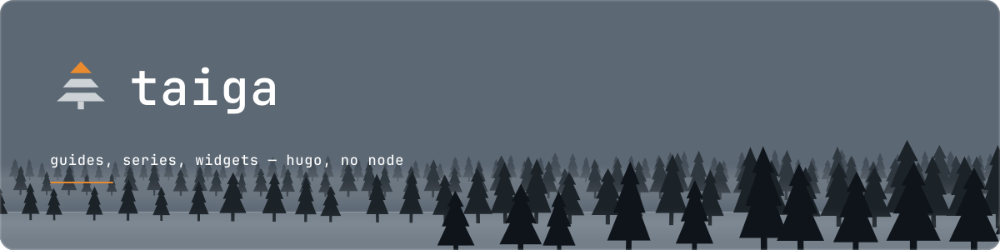
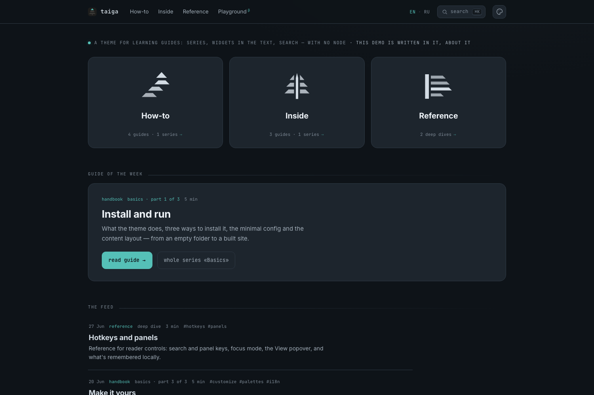

<p align="center">
  
</p>

<p align="center">
  A minimal Hugo theme for <b>learning platforms</b> — rubrics, course series,<br>
  and interactive widgets living inside the text.
</p>

<div align="center">

[](https://github.com/gohugoio/hugo/releases)
[](#status)
[](#requirements)
[](https://t.me/ntuzov)

**English** · [Русский](README.ru.md)

</div>

---

## Status

> [!WARNING]
> **v0.0.1 — beta. Unstable, and honestly so.**
>
> Params, template names and CSS tokens can still be renamed **without a
> deprecation path**, and a `hugo mod get -u` may break your site on any commit.
> I do not recommend building on it yet — if you do, pin a commit and accept the
> risk. A stable release is coming, and from that point breaking changes get a
> major bump and a migration note. Until then, treat every version as provisional.

## What it is

taiga is a theme for sites that **teach**: content is organised as rubrics →
course series → guides, and a guide can carry live JavaScript widgets in the
middle of its prose.

The demo is the theme documenting itself — it is written *in* taiga, *about*
taiga, so every mechanism on the page is also the proof that the mechanism works.

**[Live demo →](https://justskiv.github.io/taiga/)**

<p align="center">
  
</p>

## Two binaries and you're done

`hugo` and `pagefind`. No Node, no npm, no CDN, no trackers, no build pipeline to
babysit. Vanilla JS bundled by Hugo's built-in esbuild, plain CSS, self-hosted
woff2 fonts, a static search index. That constraint is not an accident — it is the
whole design, and every feature below is built to live inside it.

## Features

- **Interactive widgets as content.** Drop a `widgets.js` next to a guide's
  `index.md`: it is found, minified and loaded on that page only. One
  `` in the text mounts it, and the `Taiga.widget` runtime isolates
  failures so one broken widget never takes down its neighbours.
- **A broken internal link fails the build.** A render hook checks every internal
  link against real pages (`linkcheck = "error" | "warn"`).
- **Open Graph covers with no external service.** `images.Text` draws a cover per
  guide at build time — backdrop, series kicker, title, minutes. Cover styles are
  *folders* (`assets/og/<style>/`); a site adds or overrides one without forking.
- **Full-text search without a server.** Pagefind indexes the built site; ⌘K finds
  terms *inside* articles, with stemming and a snippet, in the theme's own modal.
- **Series as a first-class mechanic.** A taxonomy plus `series_weight` gives you
  the series panel, "part N of M" kickers, and a bottom bridge scaled by reading
  time — all server-rendered from one source of truth.
- **Server-side syntax highlighting.** Go is highlighted at build time (Chroma,
  recoloured to the palette) with `hl_lines`. No client-side highlighter, no flash.
- **Palettes are data.** Each of the seven palettes is one `data/themes/<id>.toml`
  file; a site adds its own with a single file and it appears in the CSS and in the
  theme picker. Dark, grey and light ship in the box.
- **Bilingual, and the demo proves it.** English and Russian ship as UI strings,
  dates and JS strings; the language switcher appears by itself once a site has a
  second language. Adding a third is content + config + one i18n file — no template
  edits.

## Requirements

| | |
|---|---|
| **Hugo** | ≥ 0.146 (developed against v0.154.x). The `extended` build is **not** required — this is a plain-CSS theme. |
| **[Pagefind](https://pagefind.app/)** | For search. A second build step, and still no Node. |

## Install

Pick one.

**Hugo Module** (recommended). Add the import to your site config — with a module
import you do **not** also set `theme`:

```toml
[module]
  [[module.imports]]
    path = "github.com/justskiv/taiga"
```

Then `hugo mod get -u`.

**Git submodule.** Add it under `themes/`, then set `theme = "taiga"`:

```sh
git submodule add https://github.com/justskiv/taiga.git themes/taiga
```

**Copy.** Clone or download into `themes/taiga`, then set `theme = "taiga"`.

## Quick start

```sh
hugo new site mysite && cd mysite
# install the theme by one of the methods above, then:
hugo new content howto/get-started --kind guides
hugo server
```

To run the bundled demo from a clone of this repo:

```sh
hugo server -s exampleSite --themesDir ../..
```

For the full build, with search:

```sh
hugo -s exampleSite --themesDir ../.. --gc --minify
pagefind --site exampleSite/public
```

## Documentation

| | |
|---|---|
| [docs/params.md](docs/params.md) | Every parameter, with defaults. |
| [docs/authoring.md](docs/authoring.md) | Writing a guide: front matter, shortcodes, code, diagrams, widgets. |
| [docs/customizing.md](docs/customizing.md) | Restyling without a fork: params, `custom.css`, palettes, hooks, partials. |
| [docs/i18n.md](docs/i18n.md) | Adding a language. |

Russian mirrors live in [`docs/ru/`](docs/ru/). The commented
[`exampleSite/hugo.toml`](exampleSite/hugo.toml) is a second, copy-ready reference
config — every key in it is annotated.

## License

MIT — see [LICENSE](LICENSE). The bundled fonts (Inter, JetBrains Mono) are under
the SIL Open Font License; see the `.txt` files beside them in `assets/fonts/`.
